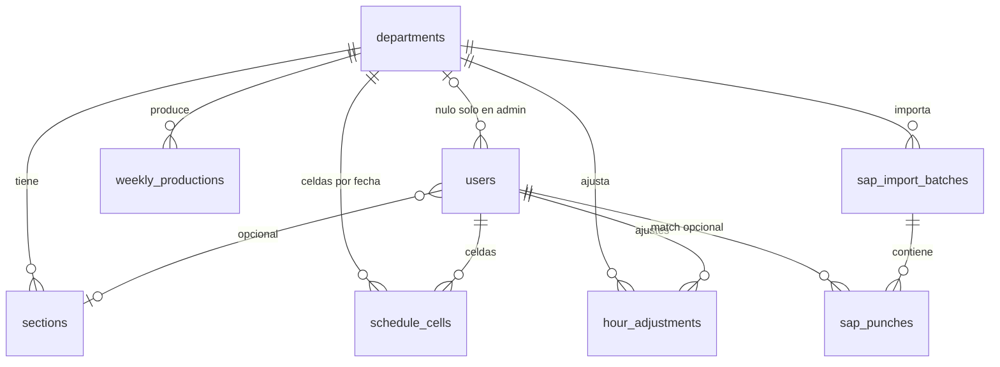

# CCP-Calendario — Modelo de datos PostgreSQL y API REST Flask

Documento de diseño (sin implementación). Destinatarios: Mauricio Lizcano y Borja Trueba.

Stack de referencia (cerrado): Vue.js (SPA) + Flask + SQLAlchemy + PostgreSQL + Flask-JWT-Extended + Docker. Este documento define persistencia, aislamiento por departamento, roles (`admin`, `mando`, `trabajador`) y el contrato HTTP que consumirá el frontend.

Coincide con `er-conceptual.md` y `decisiones.md` (22 sep 2026). No hay tablas `employees`, `absence_codes`, `schedule_weeks`, `global_parameters` ni `department_parameters`.

---

## 1. Decisiones cerradas y supuestos de diseño

Las decisiones de producto del 22 sep 2026 sustituyen SUP-01, SUP-02, SUP-03, el par Editor/Consulta y el supuesto de que el usuario nunca es la persona del cuadrante. Lo demás de esta tabla sigue siendo supuesto de trabajo reversible (no bloquea el ER).

| ID | Tema | Decisión o supuesto | Notas |
|---|---|---|---|
| SUP-01 | Fichajes SAP (RF-12) | **Cerrado.** En v1 los fichajes se **ven** y se **concilian** con la celda planificada del mismo usuario y la misma fecha: horas planificadas vs. fichadas, estado de cruce y fichajes sin emparejar. | El formato del extracto (fichero, columnas, quién carga) se detalla al implementar la importación. |
| SUP-02 | Jornada (RF-13) | **Cerrado.** Días de vacaciones al año, horas de contrato y horas de convenio son columnas del **usuario**. No hay parámetros globales ni por departamento. La franja nocturna es un único ajuste de empresa. | Vive en una fila `company_settings`. No se copia en cada usuario. |
| SUP-03 | Ajustes manuales (RF-07) | **Cerrado.** El **mando** aplica el ajuste de inmediato. No hay segundo perfil, cola de aprobación ni rol extra. | Sin columnas `approved_by` / `status`. |
| SUP-04 | Auditoría (RNF-06) | Solo **último cambio**: `last_changed_at` + `last_changed_by_user_id` en tablas de negocio. Sin historial de versiones ni tabla de eventos. | Confirmado el requisito “último cambio”. |
| SUP-05 | Concurrencia (RNF-02) | Al guardar la vista de una semana, token `version` por departamento + semana ISO. Conflicto → HTTP 409. **No** hay entidad Semana ni tabla padre de las celdas. | Nota técnica al final del §3. La semana de la pantalla se deriva de `work_date`. |
| SUP-06 | Departamento del usuario | **Cerrado.** Roles en `users`: `admin`, `mando`, `trabajador`. Sin herencia. Admin: `department_id` nulo por ahora; crea mandos. Mando: un departamento, lo edita, crea trabajadores; varios por departamento. Trabajador: solo sus filas. | No hay mando multi-departamento ni FK de jefe en `departments`. |
| SUP-07 | Persona del cuadrante | **Cerrado.** No hay tabla `employees`. La fila del cuadrante es un `users`. Celdas, ajustes y fichajes apuntan a `users`. `password_hash` NULL si todavía no entra. | Mando y admin también son usuarios; no son otra entidad. |
| SUP-08 | Baja de una persona | Baja **lógica** en `users` (`is_active = false` + `left_on`). Las celdas históricas no se borran. | Necesario para ficha anual e informes (RF-08, RF-10) y para RNF-09. |
| SUP-09 | Ausencias | **Cerrado.** Enum en la celda: `L`, `D`, `V`, `B`, `F`, `P`. No hay tabla `absence_codes`. La celda guarda un horario **o** ese enum. | Significado en `prototipo-extraido.md`. |
| SUP-10 | Secciones | Tabla `sections` por departamento. El usuario apunta a ella solo si el departamento tiene secciones (en el prototipo, solo Tráfico). La producción semanal también. | RF-09 pide palés/toneladas **por sección**. |
| SUP-11 | Identificador SAP | El usuario puede tener `sap_personnel_no` (opcional). El fichaje se empareja por ese número dentro del departamento y se concilia con la celda por **usuario + fecha**. Si no hay match, queda `unmatched`. | La ingestión no exige que todas las personas tengan número. |
| SUP-12 | Coste ETT | **Cerrado.** No hay rol `consulta`. El trabajador ve solo sus filas y no recibe tarifas ni coste ETT. El filtro es de **respuesta**, no solo de UI. | Quien edita el cuadrante del departamento es el mando. |
| SUP-13 | Exportación (RF-11) | La API expone **hooks** que devuelven JSON canónico (y, en una fase posterior, fichero). Generación Excel/PDF puede vivir en Flask o en un worker; el contrato de datos es el mismo. | Desacopla el modelo de la librería de informe. |
| SUP-14 | MY STEF (RNF-08) | Auth propia (usuario/contraseña + JWT) en v1. Quien tiene `password_hash` NULL no puede entrar. El portal enlaza a la SPA. SSO queda fuera hasta que Sistemas lo defina. | No bloquear el diseño por una identidad no especificada. |
| SUP-15 | Conservación | **Cerrado para el ER.** No hay borrado automático de cuadrantes. La retención no es un bloqueo ni un requisito de v1. | Sin job de purge; sin política de años en el esquema. |
| SUP-16 | Festivos | Tabla `public_holidays`: fecha + nombre. No cuelga del usuario ni del departamento. | La ficha anual cruza celdas trabajadas contra esta lista. |
| SUP-17 | Horas calculadas | Totales de celda (horas, nocturnas) se **persisten** al guardar, calculados en **servidor** con la franja de `company_settings`. El cliente puede previsualizar; la fuente de verdad es el backend. | No se leen de un mapa de parámetros por persona. |

**Notificaciones:** habrá avisos más adelante (pantalla, correo o MY STEF). **Fuera del ER v1:** no hay tablas ni endpoints de notificaciones en este documento; no bloquean el modelo.

**Lista de departamentos:** semilla del prototipo (`prototipo-extraido.md`), en este orden: `trafico`, `sac`, `muelle`, `choferes`, `mandos`, `mantenimiento`. El esquema sigue **genérico** (`departments.code`, N filas). Esas seis filas se siembran; no se especializa el modelo por departamento. Secciones sembradas solo en Tráfico: Administración, Nacional, Exportación, Agrupaciones.

---

## 2. Visión entidad-relación

Cajas: `Departamento`, `Usuario`, `Celda`, `Ajuste`, `Fichaje`. A un lado: `Seccion`, `Festivo`. La franja de noche es una fila de empresa, no una caja del dibujo.

No se dibujan: Empleado, Semana, Código de ausencia, Parámetro.

```
departments 1──* users                 (mando y trabajador; admin sin depto)
departments 1──* sections              (en el prototipo, solo Tráfico)
departments 1──* weekly_productions    (semana ISO derivada; no es entidad Semana)
departments 1──* sap_import_batches

users N──0..1 sections                 (sección opcional)
users 1──* schedule_cells              (fecha + horario, o fecha + ausencia)
users 1──* hour_adjustments
users 1──* sap_punches                 (emparejamiento opcional)

schedule_cells ··· sap_punches         (se comparan por usuario + fecha; sin tabla puente)

company_settings                       (una fila: franja nocturna)
public_holidays                        (fecha + nombre; no cuelga de nadie)

sap_import_batches 1──* sap_punches
```

Regla transversal: las filas de negocio de un departamento llevan `department_id`, salvo `company_settings` y `public_holidays`, y salvo `users.department_id` nulo en el admin. El mando filtra por el `department_id` del JWT. El trabajador filtra además por su propio `users.id`.

### 2.1 Diagrama lógico (Mermaid)



`company_settings` y `public_holidays` no tienen FK. La conciliación SAP es la comparación celda↔fichaje por usuario y fecha; no añade una entidad.

---

## 3. Tablas PostgreSQL

Convenciones:

- PK: `UUID` generado en aplicación (`uuid4`) o `gen_random_uuid()`.
- Tiempos: `TIMESTAMPTZ` en UTC. Horas de reloj de una celda: `TIME`.
- Decimales de horas y dinero: `NUMERIC(8,2)` horas; `NUMERIC(10,4)` tarifas.
- Auditoría último cambio (SUP-04): `last_changed_at TIMESTAMPTZ NOT NULL`, `last_changed_by_user_id UUID NULL REFERENCES users(id)`.
- Borrado: preferir `is_active`; `ON DELETE RESTRICT` en FKs de negocio; cascada solo en hijos de un lote SAP.
- La semana ISO no es tabla. Donde un recurso es semanal (vista del cuadrante, copiar semana, producción), el año y el número de semana se calculan desde la fecha, o se guardan como columnas del propio registro de producción.

### 3.1 `departments`

| Columna | Tipo | Restricciones |
|---|---|---|
| id | UUID | PK |
| code | VARCHAR(32) | UNIQUE NOT NULL |
| name | VARCHAR(120) | NOT NULL |
| sort_order | INTEGER | NOT NULL DEFAULT 0 |
| is_active | BOOLEAN | NOT NULL DEFAULT TRUE |
| created_at | TIMESTAMPTZ | NOT NULL |
| last_changed_at | TIMESTAMPTZ | NOT NULL |
| last_changed_by_user_id | UUID | FK users NULL |

Índice: `departments_is_active_idx` en `(is_active, sort_order)`.

No hay columna de jefe. Varios mandos comparten el mismo `department_id`.

### 3.2 `users`

Una sola persona. Rol `admin` | `mando` | `trabajador`. Quien ocupa una fila del cuadrante es un usuario de esta tabla.

| Columna | Tipo | Restricciones |
|---|---|---|
| id | UUID | PK |
| department_id | UUID | FK departments NULL. NOT NULL si `role` es `mando` o `trabajador`. NULL permitido en `admin` (por ahora). |
| section_id | UUID | FK sections NULL. Solo si ese departamento tiene secciones. |
| username | VARCHAR(80) | UNIQUE NOT NULL |
| password_hash | VARCHAR(255) | NULL. NULL = está en el cuadrante y todavía no entra. Nunca texto plano. |
| full_name | VARCHAR(160) | NOT NULL |
| role | VARCHAR(16) | NOT NULL CHECK (`admin` \| `mando` \| `trabajador`) |
| group_type | VARCHAR(16) | NULL CHECK (`stef` \| `ett`). NOT NULL si `role = trabajador`. |
| vacation_days_per_year | NUMERIC(5,2) | NULL. NOT NULL si `role = trabajador`. |
| contract_hours_weekly | NUMERIC(8,2) | NULL. NOT NULL si `role = trabajador`. |
| convenio_hours_annual | NUMERIC(8,2) | NULL. NOT NULL si `role = trabajador`. |
| ett_rate_weekday | NUMERIC(10,4) | NULL (solo si `group_type = ett`) |
| ett_rate_night | NUMERIC(10,4) | NULL |
| ett_rate_saturday | NUMERIC(10,4) | NULL |
| ett_rate_holiday | NUMERIC(10,4) | NULL |
| sap_personnel_no | VARCHAR(40) | NULL |
| is_active | BOOLEAN | NOT NULL DEFAULT TRUE |
| hired_on | DATE | NULL |
| left_on | DATE | NULL |
| last_login_at | TIMESTAMPTZ | NULL |
| version | INTEGER | NOT NULL DEFAULT 1 |
| created_at | TIMESTAMPTZ | NOT NULL |
| last_changed_at | TIMESTAMPTZ | NOT NULL |
| last_changed_by_user_id | UUID | FK users NULL |

Índices: `users_department_id_idx`; `users_department_role_idx` `(department_id, role)` WHERE `is_active`; UNIQUE parcial `(department_id, sap_personnel_no)` WHERE `sap_personnel_no IS NOT NULL`.

CHECK: `mando` y `trabajador` implican `department_id` NOT NULL. `trabajador` implica `group_type`, `vacation_days_per_year`, `contract_hours_weekly` y `convenio_hours_annual` NOT NULL. Si `section_id` viene informado, esa sección pertenece al mismo departamento.

El grupo STEF/ETT es esta columna. Los nombres de grupo de filas del prototipo (Equipo tráfico, Atención al cliente, etc.) no son una tabla.

**Clave.** El login exige `password_hash` NOT NULL e `is_active`. El mando puede rellenar la clave después (PATCH) cuando esa persona deba entrar. Admin y mando se crean con clave: si no, no pueden ejercer el rol.

**Aislamiento.** Un mando no apunta a otro departamento. Varios mandos por departamento: no hay UNIQUE de un solo mando. El admin crea mandos. El mando crea los trabajadores de su equipo. Sin herencia de tablas.

Las columnas `ett_rate_*` **no se incluyen** en la respuesta del trabajador (SUP-12). El trabajador no recibe otras filas de esta tabla.

### 3.3 `sections`

| Columna | Tipo | Restricciones |
|---|---|---|
| id | UUID | PK |
| department_id | UUID | FK departments NOT NULL |
| code | VARCHAR(32) | NOT NULL |
| name | VARCHAR(120) | NOT NULL |
| is_active | BOOLEAN | NOT NULL DEFAULT TRUE |
| last_changed_at / last_changed_by_user_id | | como arriba |

UNIQUE `(department_id, code)`.

Semilla del prototipo: solo Tráfico (Administración, Nacional, Exportación, Agrupaciones). El resto de departamentos no tiene filas aquí; en esos usuarios `section_id` queda NULL.

### 3.4 `schedule_cells`

Celda de un usuario en un día (RF-03, RF-04). O guarda un horario, o guarda una ausencia. No hay fila “vacía”: un día sin celda es un día sin plan.

| Columna | Tipo | Restricciones |
|---|---|---|
| id | UUID | PK |
| department_id | UUID | FK departments NOT NULL (desnormalizado; el mismo que el usuario) |
| user_id | UUID | FK users NOT NULL |
| work_date | DATE | NOT NULL |
| time_start | TIME | NULL |
| time_end | TIME | NULL (puede cruzar medianoche) |
| crosses_midnight | BOOLEAN | NOT NULL DEFAULT FALSE |
| raw_input | VARCHAR(32) | NULL (texto original, p. ej. `6-14` o `V`, para round-trip de la UX) |
| absence | VARCHAR(1) | NULL CHECK (`L` \| `D` \| `V` \| `B` \| `F` \| `P`) |
| planned_hours | NUMERIC(8,2) | NOT NULL DEFAULT 0 |
| planned_night_hours | NUMERIC(8,2) | NOT NULL DEFAULT 0 |
| last_changed_at / last_changed_by_user_id | | |

CHECK: o bien `absence` IS NULL y `time_start`/`time_end` NOT NULL (horario), o bien `absence` NOT NULL y `time_start`/`time_end` NULL (ausencia).

| Código | Significado |
|---|---|
| L | Libranza |
| D | Domingo |
| V | Vacaciones |
| B | Baja |
| F | Festivo |
| P | Permiso |

Los códigos de turno del prototipo (`M`, `T`, `N` y variantes) no son este enum. Si representan una franja, se guardan como horario.

UNIQUE `(user_id, work_date)`.

Índices: `(department_id, work_date)`; `(user_id, work_date)`.

`planned_*` se recalcula en servidor con la franja de `company_settings` (SUP-17). No hay `schedule_week_id` ni `absence_code_id`. La semana ISO de una celda es `EXTRACT` / cálculo sobre `work_date` (lunes como inicio de semana ISO). Tras guardar celdas, el servidor recalcula la conciliación SAP de esos usuarios y fechas.

### 3.5 `hour_adjustments`

Ajustes puntuales (RF-07). El mando los aplica al momento (SUP-03).

| Columna | Tipo | Restricciones |
|---|---|---|
| id | UUID | PK |
| department_id | UUID | FK departments NOT NULL |
| user_id | UUID | FK users NOT NULL |
| adjustment_date | DATE | NOT NULL |
| hours_delta | NUMERIC(8,2) | NOT NULL CHECK ≠ 0 |
| reason | VARCHAR(500) | NOT NULL |
| created_at | TIMESTAMPTZ | NOT NULL |
| last_changed_at / last_changed_by_user_id | | |
| version | INTEGER | NOT NULL DEFAULT 1 |

Índice: `(department_id, user_id, adjustment_date)`.

No hay columnas `approved_by` / `status`. Un POST/DELETE de ajuste recalcula la conciliación SAP de ese usuario y esa fecha si hay fichaje.

### 3.6 `weekly_productions`

RF-09: palés y toneladas por sección y semana. La semana no es una entidad: `iso_year` e `iso_week` son columnas de este registro, derivadas del calendario (la misma regla que agrupa las celdas por `work_date`). No hay FK a una tabla de semanas.

| Columna | Tipo | Restricciones |
|---|---|---|
| id | UUID | PK |
| department_id | UUID | FK departments NOT NULL |
| section_id | UUID | FK sections NOT NULL |
| iso_year | INTEGER | NOT NULL |
| iso_week | INTEGER | NOT NULL CHECK 1–53 |
| pallets | NUMERIC(12,2) | NOT NULL DEFAULT 0 |
| tonnes | NUMERIC(12,3) | NOT NULL DEFAULT 0 |
| version | INTEGER | NOT NULL DEFAULT 1 |
| last_changed_at / last_changed_by_user_id | | |

UNIQUE `(section_id, iso_year, iso_week)`.

### 3.7 `company_settings`

Una sola fila. Aquí vive la franja nocturna de la empresa (a qué hora empieza y a qué hora acaba la noche). Es el único ajuste que antes era un parámetro global y **no** pasa al usuario.

| Columna | Tipo | Restricciones |
|---|---|---|
| id | SMALLINT | PK, CHECK (`id = 1`) |
| night_start | TIME | NOT NULL (ejemplo del prototipo: `22:00`) |
| night_end | TIME | NOT NULL (ejemplo del prototipo: `06:00`) |
| last_changed_at | TIMESTAMPTZ | NOT NULL |
| last_changed_by_user_id | UUID | FK users NULL |

No hay `vacation_days_per_year`, `contract_hours_weekly` ni `convenio_hours_annual` en esta tabla: esas columnas están en `users`. No hay `department_parameters`.

La escribe el admin (vale para toda la empresa). Mando y trabajador la leen para calcular horas; no la copian a sus usuarios.

### 3.8 Fichajes SAP (RF-12)

Visibles y conciliados con la celda planificada por usuario + fecha.

#### `sap_import_batches`

| Columna | Tipo | Restricciones |
|---|---|---|
| id | UUID | PK |
| department_id | UUID | FK departments NOT NULL |
| source_label | VARCHAR(120) | NOT NULL (nombre de fichero o job) |
| period_iso_year | INTEGER | NULL (etiqueta del lote, no una entidad Semana) |
| period_iso_week | INTEGER | NULL |
| status | VARCHAR(16) | NOT NULL CHECK (`received` \| `processed` \| `failed`) |
| row_count | INTEGER | NOT NULL DEFAULT 0 |
| unmatched_count | INTEGER | NOT NULL DEFAULT 0 |
| error_summary | TEXT | NULL |
| raw_checksum | VARCHAR(64) | NULL (idempotencia) |
| imported_at | TIMESTAMPTZ | NOT NULL |
| last_changed_at / last_changed_by_user_id | | NULL (puede ser job, no usuario) |

UNIQUE opcional `(department_id, raw_checksum)` WHERE checksum NOT NULL.

#### `sap_punches`

Fila = agregado por persona y día (lo habitual en extractos semanales); `raw_payload` conserva el original si llega un intervalo.

| Columna | Tipo | Restricciones |
|---|---|---|
| id | UUID | PK |
| department_id | UUID | FK departments NOT NULL |
| batch_id | UUID | FK sap_import_batches NOT NULL ON DELETE CASCADE |
| sap_personnel_no | VARCHAR(40) | NOT NULL |
| user_id | UUID | FK users NULL |
| punch_date | DATE | NOT NULL |
| time_in | TIMESTAMPTZ | NULL |
| time_out | TIMESTAMPTZ | NULL |
| punched_hours | NUMERIC(8,2) | NOT NULL DEFAULT 0 |
| punched_night_hours | NUMERIC(8,2) | NOT NULL DEFAULT 0 |
| match_status | VARCHAR(16) | NOT NULL CHECK (`matched` \| `unmatched` \| `ignored`) |
| planned_hours_snapshot | NUMERIC(8,2) | NOT NULL DEFAULT 0 — horas planificadas de ese usuario ese día (celda + ajustes de esa fecha) |
| variance_hours | NUMERIC(8,2) | NOT NULL DEFAULT 0 — `punched_hours - planned_hours_snapshot` |
| reconciliation_status | VARCHAR(16) | NOT NULL CHECK (`ok` \| `mismatch` \| `unmatched` \| `no_plan`) |
| raw_payload | JSONB | NULL |
| last_changed_at / last_changed_by_user_id | | NULL |

UNIQUE `(department_id, sap_personnel_no, punch_date)` — un agregado diario por persona en el departamento (reimportar = upsert).

Índices: `(department_id, punch_date)`; `(user_id, punch_date)`; `(match_status)` WHERE `unmatched`; `(reconciliation_status)`.

Conciliación en v1 (al importar y al guardar la celda o el ajuste de ese usuario y esa fecha):

1. Emparejar `user_id` si `sap_personnel_no` existe en un usuario del departamento (`match_status`).
2. Tomar la celda `(user_id, work_date = punch_date)` y sumar los ajustes de ese usuario y fecha.
3. Guardar snapshot, `variance_hours` y `reconciliation_status`:
   - `unmatched` — no hay usuario;
   - `no_plan` — usuario sí, pero no hay celda ese día;
   - `ok` — hay celda y la diferencia de horas está dentro de 0,01 h;
   - `mismatch` — hay celda y la diferencia supera 0,01 h.

No hay valor `reference_only`. El cruce no crea otra tabla.

### 3.9 `public_holidays`

Lista suelta. No va por usuario ni por departamento.

| Columna | Tipo | Restricciones |
|---|---|---|
| id | UUID | PK |
| holiday_date | DATE | UNIQUE NOT NULL |
| name | VARCHAR(120) | NOT NULL |

La ficha anual cuenta festivos trabajados cruzando celdas con horario frente a esta fecha.

### 3.10 Auditoría

| Campo | Dónde | Uso |
|---|---|---|
| `last_changed_at` | Tablas de negocio | RNF-06 |
| `last_changed_by_user_id` | Igual | Quién; NULL si job SAP |
| `version` | `users`, `hour_adjustments`, `weekly_productions` | RNF-02 en el PATCH de esa fila |

No hay tabla `audit_events`.

### 3.11 Concurrencia al guardar la semana (nota técnica)

No es una caja del ER y no es una tabla obligatoria.

El GET de una semana de departamento devuelve un entero `version`. El PUT de esa misma semana lo reenvía. Si el token no coincide, HTTP 409. El token identifica el par (departamento, semana ISO derivada de las fechas), no una fila `schedule_weeks` de la que cuelguen las celdas.

**Opción de implementación (opcional).** Si hace falta persistir el token, basta una fila técnica `(department_id, iso_year, iso_week, version)`. Las celdas no la referencian. No se dibuja. Se puede omitir y comparar el token de otra forma (por ejemplo un hash del último `last_changed_at` de las celdas de esas fechas), siempre que el GET y el PUT usen la misma regla y el conflicto siga siendo 409.

---

## 4. Aislamiento por departamento (fila y filtro)

Reglas:

1. **Mando y trabajador** tienen un `department_id`. **Admin** puede tenerlo nulo. El claim JWT `dept` es esa UUID, o null en el admin. No se acepta un `department_id` de body que no coincida con el del mando.
2. **Lectura del mando:** `WHERE department_id = :jwt_dept`. **Trabajador:** además `user_id = :jwt_sub` (solo sus celdas, ajustes y fichajes). No lista el departamento entero.
3. `company_settings` y `public_holidays` se leen al calcular horas y la ficha. El admin puede actualizar la franja y los festivos (son de la empresa). El mando no tiene parámetros de vacaciones ni de convenio que volcar: eso se edita en el usuario. El trabajador no escribe.
4. Defensa en profundidad (recomendada en PostgreSQL, no sustituye el filtro de API):

```sql
ALTER TABLE schedule_cells ENABLE ROW LEVEL SECURITY;
CREATE POLICY schedule_cells_isolation ON schedule_cells
  USING (department_id = current_setting('app.department_id')::uuid);
```

El pool de Flask, tras autenticar, ejecuta `SET LOCAL app.department_id = ...` y `SET LOCAL app.user_role = ...` en la transacción. Si el rol es `trabajador`, también `SET LOCAL app.user_id = ...`. La misma policy de departamento encaja en `users`, `sections`, `hour_adjustments`, `weekly_productions`, `sap_punches`, `sap_import_batches`. En celdas, ajustes y fichajes, el trabajador queda además recortado a su `user_id` en la API. `company_settings` y `public_holidays` no llevan `department_id`.

5. **Sin visibilidad cruzada:** un `GET /users/{id}` de otro departamento, o de otra persona cuando quien pide es trabajador, responde **404** (no 403), para no filtrar existencia.

---

## 5. Roles: admin, mando, trabajador

Una tabla `users`. Sin herencia. Sin perfil Consulta: el trabajador es quien entra y ve solo lo suyo.

| Capacidad | admin | mando | trabajador |
|---|---|---|---|
| Login / refresh | Sí (con clave) | Sí (con clave) | Solo si `password_hash` no es NULL |
| Alta de mandos | Sí (asigna el departamento del mando y una clave) | No | No |
| Alta de trabajadores de su equipo | No | Sí. Clave opcional. | No |
| Ver el departamento | No es su pantalla (aún sin `department_id`) | El suyo | No: solo sus filas |
| Leer / escribir cuadrante, copiar semana, producción | No en este cierre | Sí | Lectura solo de su fila; escritura 403 |
| Ajustes de horas | No | Sí, directo, sin aprobación | 403 |
| Ficha, fichajes SAP y conciliación | No en este cierre | Los de su departamento (POST import sí, o job de Sistemas) | Solo los suyos; POST import 403 |
| Análisis y coste ETT | No recibe coste (no edita) | Sí, con coste ETT de su departamento | Solo su fila, sin coste ETT |
| Franja nocturna y festivos | GET y PUT (empresa) | GET | GET |
| Vacaciones, contrato, convenio | No son suyos | Los edita en cada trabajador de su equipo | GET de los suyos; PATCH 403 |

Decoradores previstos: `@jwt_required()`, `@role_required("mando")` en mutaciones del cuadrante. Alta de mandos y PUT de `company_settings`: `@role_required("admin")`. Serializers: `ett_rate_*` y el coste solo si `role == mando`.

El trabajador **no** recibe: `ett_rate_*`, `ett_cost`, `coste_ett`, desglose monetario por tarifa. Si un campo se calcula solo para dinero, no se calcula en esa respuesta (no vale mandarlo a `null`). Tampoco recibe filas de otras personas.

---

## 6. API REST (Flask + Flask-JWT-Extended)

Base: `/api/v1`. JSON UTF-8. Auth: `Authorization: Bearer <access_token>`.

Los paths `/weeks/...` y `/months/...` son la **vista**. Persisten celdas con `work_date`. No crean una entidad Semana.

### 6.1 Auth

| Método | Path | Rol | Cuerpo / respuesta |
|---|---|---|---|
| POST | `/auth/login` | público | Req: `{ "username", "password" }`. Res 200: `{ "access_token", "refresh_token", "user": { "id", "username", "full_name", "role", "department": { "id", "code", "name" } \| null } }`. `department` es null en el admin. |
| POST | `/auth/refresh` | refresh JWT | `{ "access_token" }` |
| GET | `/auth/me` | autenticado | Mismo objeto `user` |
| POST | `/auth/logout` | autenticado | 204 (revocar refresh si se persiste jti; v1 puede ser stateless) |

Claims del access token: `sub` (user id), `role` (`admin` \| `mando` \| `trabajador`), `dept` (null si el admin no tiene departamento), `exp`. TTL corto (p. ej. 15–30 min) + refresh.

Errores login: 401 `{ "error": { "code": "invalid_credentials", "message": "Usuario o contraseña incorrectos" } }`. Usuario inactivo: `code: "user_inactive"`. Usuario sin clave (`password_hash` NULL): el mismo 401, sin revelar que la fila existe.

### 6.2 Modelo de error

```json
{
  "error": {
    "code": "conflict",
    "message": "El cuadrante ha sido modificado por otro usuario",
    "details": [{ "field": "version", "expected": 4, "actual": 5 }]
  }
}
```

| HTTP | code típico | Cuándo |
|---|---|---|
| 400 | `bad_request` | JSON inválido |
| 401 | `unauthorized` / `invalid_credentials` | Sin token o login fallido |
| 403 | `forbidden` | Rol sin esa escritura; o tarifas ETT en una petición del trabajador |
| 404 | `not_found` | Recurso inexistente **en su departamento** (o que no es su fila) |
| 409 | `conflict` | `version` no coincide (RNF-02) |
| 422 | `validation_error` | Celda `25-99`, ausencia fuera del enum, horas 0 en ajuste, horario y ausencia a la vez |
| 500 | `internal_error` | No filtrar internals |

Mutaciones del cuadrante semanal: el cliente envía `"version": <n>` del token de §3.11. Éxito devuelve el token incrementado. Cabecera opcional `If-Match: "<n>"` con el mismo significado.

### 6.3 Recursos y formas

Prefijo implícito: el departamento del mando y del trabajador sale del JWT. **No** hay `/departments/{otherId}/...` para datos de negocio.

#### Departamento

| Método | Path | Rol | Notas |
|---|---|---|---|
| GET | `/department` | mando, trabajador | `{ id, code, name }` del JWT. Admin: 404 (no tiene departamento). |

No existe `GET/PUT /parameters` ni `/department/parameters`.

#### Franja nocturna — lo que queda de RF-13 a nivel empresa

| Método | Path | Rol | Notas |
|---|---|---|---|
| GET | `/company-settings` | autenticado | `{ "night_start": "22:00", "night_end": "06:00" }` |
| PUT | `/company-settings` | admin | Mismo cuerpo. Actualiza la fila única. No toca usuarios. |

Vacaciones, horas de contrato y horas de convenio se leen y escriben en el usuario (§ personas).

#### Secciones — soporte RF-06 / RF-09

| Método | Path | Rol |
|---|---|---|
| GET | `/sections` | mando, trabajador |
| POST | `/sections` | mando `{ code, name }` |
| PATCH | `/sections/{id}` | mando |
| POST | `/sections/{id}/deactivate` | mando (baja lógica) |

#### Personas del cuadrante — RF-06

Recurso `/users` del departamento. No hay `/employees`.

| Método | Path | Rol | Forma |
|---|---|---|---|
| GET | `/users` | mando: su departamento; trabajador: solo él | Query: `active=true`. El trabajador no recibe `ett_rate_*` ni filas ajenas. |
| POST | `/users` | admin o mando | Ver cuerpos. |
| GET | `/users/{id}` | mando en su depto; trabajador solo si es él | 404 en caso contrario |
| PATCH | `/users/{id}` | mando (su equipo); admin solo sobre mandos | Incluye `version`. Puede pasar `password` en claro para fijar la clave; la respuesta nunca devuelve el hash. |
| POST | `/users/{id}/deactivate` | mando (trabajador de su equipo) | `{ left_on }` |

POST del **admin** (crea un mando):

```json
{
  "role": "mando",
  "username": "ana",
  "password": "...",
  "full_name": "Ana Ruiz",
  "department_id": "..."
}
```

POST del **mando** (crea un trabajador en su departamento; el `department_id` sale del JWT, no del body):

```json
{
  "role": "trabajador",
  "username": "luis",
  "password": null,
  "full_name": "Luis Gómez",
  "group_type": "stef",
  "section_id": null,
  "vacation_days_per_year": 22,
  "contract_hours_weekly": 40,
  "convenio_hours_annual": 1760,
  "sap_personnel_no": null,
  "ett_rate_weekday": null
}
```

`password` null deja `password_hash` NULL. `section_id` solo si el departamento tiene secciones. En ETT el mando puede enviar `ett_rate_*`.

#### Cuadrante semanal / mensual — RF-03, RF-04

La semana ISO del path es la agrupación de celdas cuya `work_date` cae en esa semana. El mes se pide por rango de fechas.

**GET** `/weeks/{iso_year}/{iso_week}`

Respuesta (mando: el departamento; trabajador: solo su fila). Sin costes.

```json
{
  "iso_year": 2026,
  "iso_week": 12,
  "start": "2026-03-16",
  "end": "2026-03-22",
  "version": 4,
  "last_changed_at": "2026-03-18T10:12:00Z",
  "last_changed_by": { "id": "...", "full_name": "Ana Ruiz" },
  "users": [
    {
      "id": "...",
      "full_name": "Luis Gómez",
      "group_type": "stef",
      "section_id": null,
      "vacation_days_per_year": 22,
      "contract_hours_weekly": 40,
      "convenio_hours_annual": 1760,
      "cells": [
        {
          "work_date": "2026-03-16",
          "raw_input": "6-14",
          "time_start": "06:00",
          "time_end": "14:00",
          "absence": null,
          "planned_hours": 8,
          "planned_night_hours": 0
        },
        {
          "work_date": "2026-03-17",
          "raw_input": "L",
          "time_start": null,
          "time_end": null,
          "absence": "L",
          "planned_hours": 0,
          "planned_night_hours": 0
        }
      ],
      "week_hours": 40,
      "week_night_hours": 4,
      "adjustments_hours": 1.5
    }
  ],
  "punches": [
    {
      "user_id": "...",
      "sap_personnel_no": "12345",
      "punch_date": "2026-03-16",
      "punched_hours": 8.1,
      "punched_night_hours": 0,
      "planned_hours": 8,
      "variance_hours": 0.1,
      "match_status": "matched",
      "reconciliation_status": "mismatch"
    }
  ],
  "reconciliation_summary": {
    "punched_hours": 8.1,
    "planned_hours": 8,
    "unmatched_count": 0,
    "mismatch_count": 1,
    "ok_count": 0
  }
}
```

`version` es el token de §3.11, no el id de una semana. `punches` vacíos si no hay lote. Los `unmatched` van en el mismo array (`user_id` null). El trabajador solo ve sus punches.

**PUT** `/weeks/{iso_year}/{iso_week}` — mando

```json
{
  "version": 4,
  "cells": [
    { "user_id": "...", "work_date": "2026-03-16", "raw_input": "22-6" },
    { "user_id": "...", "work_date": "2026-03-17", "raw_input": "V" }
  ]
}
```

El servidor exige que `work_date` caiga en esa semana ISO. Parsea `raw_input` como horario o como enum `L|D|V|B|F|P`, calcula horas y noche con `company_settings`, hace upsert de la celda (o la borra si el texto viene vacío), comprueba el token y **recalcula la conciliación SAP** de esos usuarios y fechas. Res 200 = mismo GET. Res 409 si el token no coincide. No inserta una fila de semana.

**GET** `/months/{year}/{month}` — mando y trabajador  
Agrega las celdas cuyas fechas caen en el mes (y las semanas ISO que el mes cruza, solo como cortes de la vista). Cada bloque de semana ISO lleva su token `version`. El guardado del mes son N PUT semanales. Alternativa: PUT `/months/{y}/{m}` con `{ "weeks": [ { "iso_year", "iso_week", "version", "cells": [] } ] }`, todo-o-nada; si un token falla, 409 `{ "conflicts": [...] }` y no se aplica nada.

**Recomendación:** todo-o-nada a nivel de **una semana de fechas**; la vista mes guarda semana a semana.

#### Copiar semana anterior — RF-05

**POST** `/weeks/{iso_year}/{iso_week}/copy-previous` — mando

Body: `{ "version": 4 }` (token de la semana **destino**).

Efecto: lee las celdas del mismo departamento cuya `work_date` cae en la semana ISO anterior y las copia a la misma posición de la semana destino (fecha + 7 días), para usuarios activos. No copia ajustes, producción ni fichajes. No lee ni escribe una entidad Semana. 409 si el destino cambió; 404 si la semana origen no tiene celdas.

#### Ajustes — RF-07

| Método | Path | Rol |
|---|---|---|
| GET | `/users/{id}/adjustments?from=&to=` | mando; trabajador solo si `{id}` es él |
| POST | `/users/{id}/adjustments` | mando `{ adjustment_date, hours_delta, reason }` |
| DELETE | `/adjustments/{id}` | mando (o PATCH motivo/horas con `version`) |

El mando aplica al instante. No hay campo de aprobación.

#### Producción — RF-09

| Método | Path | Rol |
|---|---|---|
| GET | `/production/{iso_year}/{iso_week}` | mando, trabajador `{ "sections": [ { section_id, pallets, tonnes, version } ] }` |
| PUT | `/production/{iso_year}/{iso_week}` | mando. Mismo shape, `version` por fila. |

El par año/semana identifica el registro de producción. No apunta a una tabla de semanas.

#### Análisis — RF-08

**GET** `/analysis?from=2026-01-01&to=2026-03-31` (o `iso_year` + `from_week` + `to_week`, interpretados como rango de fechas)

Respuesta del mando:

```json
{
  "period": { "from": "...", "to": "..." },
  "ranking_hours": [{ "user_id": "...", "full_name": "...", "hours": 0, "night_hours": 0 }],
  "by_user": [{ "user_id": "...", "hours": 0, "night_hours": 0, "adjustments": 0, "absence_totals": { "V": 5 }, "ett_cost": 1234.5 }],
  "absence_totals": { "V": 120, "F": 8 },
  "production_totals": { "pallets": 0, "tonnes": 0, "by_section": [] },
  "ett_cost_total": 9999.99,
  "reconciliation": {
    "punched_hours": 0,
    "planned_hours": 0,
    "unmatched_count": 0,
    "mismatch_count": 0,
    "ok_count": 0
  }
}
```

El trabajador: sin `ett_cost`, `ett_cost_total` ni `ett_rate`; sin ranking ni filas de otros. El bloque `reconciliation` de lo suyo sí (no es coste).

Cálculo de coste ETT en servidor: horas de celdas de usuarios `group_type = ett` × tarifa de **ese usuario** según el día (laborable / noche / sábado / festivo), usando `public_holidays` y la franja de `company_settings`.

#### Ficha anual — RF-10

**GET** `/users/{id}/annual-sheet?year=2026`

```json
{
  "user": {
    "id": "...",
    "full_name": "...",
    "group_type": "stef",
    "section": null,
    "vacation_days_per_year": 26,
    "contract_hours_weekly": 40,
    "convenio_hours_annual": 1760
  },
  "year": 2026,
  "by_month": [{ "month": 1, "hours": 160, "night_hours": 12, "adjustments": 2, "saturdays_worked": 2, "holidays_worked": 1 }],
  "year_totals": { "hours": 0, "night_hours": 0, "adjustments": 0, "vacation_days": 0, "saturdays_worked": 0, "holidays_worked": 0 },
  "adjustments": [{ "adjustment_date": "2026-01-15", "hours_delta": 2, "reason": "..." }],
  "night_band": { "night_start": "22:00", "night_end": "06:00" },
  "signature_placeholder": true
}
```

`vacation_days_per_year` es el del usuario (un director puede tener otro número). `night_band` es la fila de empresa, no un parámetro copiado. Sin tarifas ni coste si quien pide no es mando. El trabajador solo pide su propio `id`. La impresión/PDF es de la SPA o del hook de export; este endpoint es el dato.

#### Exportación — RF-11 (hooks)

| Método | Path | Rol | Respuesta |
|---|---|---|---|
| GET | `/exports/week/{iso_year}/{iso_week}` | mando; trabajador solo su fila | JSON canónico = GET week (sin coste ETT si no es mando). Query `format=json` (v1). `format=xlsx\|pdf` → 501 hasta implementar fichero, o stream cuando exista. |
| GET | `/exports/analysis?...` | mando; trabajador solo lo suyo | Igual que análisis |
| GET | `/exports/annual-sheet/{user_id}?year=` | mando; trabajador solo su id | Igual que ficha |

Contrato estable: el frontend no depende de binarios en v1.

#### SAP — RF-12

| Método | Path | Rol | Forma |
|---|---|---|---|
| POST | `/sap/imports` | mando (o servicio) | Multipart o JSON: `{ "source_label", "iso_year?", "iso_week?", "rows": [ { "sap_personnel_no", "punch_date", "time_in?", "time_out?", "punched_hours", "punched_night_hours?", "raw"? } ] }`. Al persistir, empareja usuario y concilia con la celda de esa fecha. |
| GET | `/sap/imports` | mando | Lista lotes del departamento |
| GET | `/sap/imports/{id}` | mando | Lote + conteos matched/unmatched/ok/mismatch/no_plan |
| GET | `/sap/punches?from=&to=&match_status=&reconciliation_status=` | mando; trabajador solo los suyos | Fichajes + planificado + variance + estados; sin costes |

Idempotencia: upsert por `(department_id, sap_personnel_no, punch_date)`. `iso_year` / `iso_week` del lote son etiqueta, no una FK. El detalle de fichero, columnas y quién carga se fija al implementar la importación.

#### Festivos

No hay `GET /absence-codes`. El enum de la celda es cerrado.

| Método | Path | Rol |
|---|---|---|
| GET | `/holidays?year=2026` | autenticado. Lista de la empresa: `{ holiday_date, name }`. |
| POST | `/holidays` | admin `{ holiday_date, name }` |
| DELETE | `/holidays/{id}` | admin |

### 6.4 Mapeo RF → endpoints

| RF | Endpoints |
|---|---|
| RF-01 Acceso por roles | `POST /auth/login`, `POST /auth/refresh`, `GET /auth/me`; claims `role`; serializers ETT |
| RF-02 Departamento | `GET /department` (el del JWT) |
| RF-03 Vista semanal | `GET/PUT /weeks/{iso_year}/{iso_week}` sobre celdas por fecha |
| RF-04 Vista mensual | `GET /months/{year}/{month}`; escrituras vía PUT semanal (o PUT mes todo-o-nada) |
| RF-05 Copiar semana | `POST /weeks/{iso_year}/{iso_week}/copy-previous` (copia celdas por fecha) |
| RF-06 Personas | `GET/POST /users`, `GET/PATCH /users/{id}`, `POST .../deactivate`; `GET/POST /sections` |
| RF-07 Ajustes | `GET/POST /users/{id}/adjustments`, `DELETE /adjustments/{id}` |
| RF-08 Análisis | `GET /analysis` |
| RF-09 Producción | `GET/PUT /production/{iso_year}/{iso_week}` |
| RF-10 Ficha | `GET /users/{id}/annual-sheet` |
| RF-11 Exportación | `GET /exports/week/...`, `/exports/analysis`, `/exports/annual-sheet/...` |
| RF-12 Origen + SAP | PUT de celdas + `POST /sap/imports` + `GET /sap/punches` (cruce por usuario y fecha) |
| RF-13 Jornada | Columnas del usuario; `GET/PUT /company-settings` solo para la franja nocturna |

RNF cubiertos por el contrato: RNF-01 (JWT + rol en servidor + hash), RNF-02 (token `version` + 409), RNF-06 (campos de último cambio en el GET de la semana), RNF-09 (migración, §8). RNF-03/04/05/07/08 son de operación e infraestructura, no de este modelo.

---

## 7. Notas SQLAlchemy (bosquejo, no código de producción)

Módulo previsto: `app/models.py` (un bound `db = SQLAlchemy()`). Nombres de clase en singular PascalCase; tablas en plural `snake_case` como arriba.

| Modelo | Relación |
|---|---|
| `Department` | `users`, `sections`, `weekly_productions` |
| `User` | `department` nullable; `section` nullable; `role` como `Enum` `admin` \| `mando` \| `trabajador`; `cells`, `adjustments`, `punches` |
| `Section` | `department`; `users`; `productions` |
| `ScheduleCell` | `user`, `department`; `absence` enum o nulo; hook al guardar para `planned_hours` con `CompanySettings` |
| `HourAdjustment` | `user`, `department` |
| `WeeklyProduction` | `section`, `department`; `iso_year` + `iso_week` sin FK de semana |
| `CompanySettings` | fila `id = 1` |
| `SapImportBatch` | `punches` |
| `SapPunch` | `batch`; `user` nullable |
| `PublicHoliday` | sin FK |

No hay modelos `Employee`, `AbsenceCode`, `ScheduleWeek`, `GlobalParameter` ni `DepartmentParameter`.

Patrones:

- Mixin `LastChangeMixin` (`last_changed_at`, `last_changed_by_user_id`).
- Mixin `VersionMixin` (`version`) en usuario, ajuste y producción.
- Mixin `DepartmentScoped`: columna `department_id` + filtro automático en la query, salvo `CompanySettings` y `PublicHoliday`.
- `User.to_dict(role)` omite `ett_rate_*` y `password_hash` si quien pide no es mando. Nadie recibe el hash.
- Unicidad: `UniqueConstraint` / `Index(..., postgresql_where=...)` para `sap_personnel_no`.
- El PUT semanal compara el token de §3.11 dentro de la transacción que upserta celdas. 0 coincidencias → 409. No hace `UPDATE` de una fila padre de celdas, salvo que se haya elegido la opción opcional de esa nota.

Alembic: revisión inicial = este esquema. No hay modelos Flask que commitear en este entregable.

---

## 8. Migración desde prototipo localStorage + Excels (RNF-09)

Nivel alto; sin scripts en este documento.

1. **Inventario:** un JSON/export por departamento piloto (volcado de `localStorage`) + libros Excel vivos (cuadrante, personas, producción, posibles extractos SAP).
2. **Maestros primero:** `departments` (código estable; semilla en `prototipo-extraido.md`) → `sections` (solo Tráfico) → fila `company_settings` (franja 22:00–06:00 del prototipo) → `users`. La comprobación de contraseña en el navegador no se reutiliza. Cada persona del cuadrante es un usuario `trabajador`; la clave queda NULL hasta que el mando la fije. Mando y admin se crean aparte, con clave.
3. **Columnas de la persona:** nombre, grupo STEF/ETT, sección si el departamento la tiene, horas de contrato, horas de convenio, días de vacaciones. `sap_personnel_no` si el Excel lo trae; si no, NULL y los fichajes irán `unmatched` hasta completar. Tarifas ETT solo si el fichero las trae.
4. **Cuadrante:** cada celda de texto → parser de la API (`raw_input`). Se inserta `schedule_cells` con su `work_date`. Horario o enum `L|D|V|B|F|P`. No se crean filas de semana. `planned_*` se recalcula en servidor con `company_settings` (no se copian los totales del Excel a ciegas).
5. **Ajustes y producción:** filas Excel → `hour_adjustments` / `weekly_productions`. En producción, `iso_year` e `iso_week` se derivan de la fecha de esa fila. Motivo obligatorio: si el Excel no lo tiene, placeholder `"Migración Excel {fichero}"` (documentado, no vacío).
6. **Fichajes SAP históricos** (si existen en Excel): un `sap_import_batches` etiquetado `migration` + upsert de `sap_punches` conciliados contra la celda de ese usuario y esa fecha.
7. **Festivos:** carga de `public_holidays` (fecha + nombre). Una lista, no una por usuario.
8. **Validación:** para una semana piloto, comparar totales de horas, noche y coste ETT (solo en sesión de mando) del prototipo contra la API; umbral 0,01 h / 0,01 €. Una discrepancia es del parser o de la franja, no un redondeo silencioso.
9. **Corte:** a partir del go-live, el Excel deja de ser maestro; la API es la fuente de verdad. Conservar copias de los ficheros de origen (RNF-07, Sistemas).

No se migran `employees`, catálogos de ausencia, parámetros globales ni semanas como tablas.

---

## 9. Pendiente (cuando haya material)

No se envían cuestionarios técnicos al solicitante. Lo que sigue está en `decisiones.md` y **no bloquea** este ER.

- Cómo llegará el extracto SAP (fichero, columnas, quién lo carga): se detalla al implementar la importación.
- Cómo se hacen los avisos (pantalla, correo, MY STEF). Fuera del ER v1: no hay esquema de notificaciones.

La lista de departamentos, las secciones de Tráfico y los códigos `L D V B F P` ya están en `prototipo-extraido.md`.

---

*Fin del diseño. No incluye scaffolding Vue/Flask; la implementación partirá de este contrato.*
